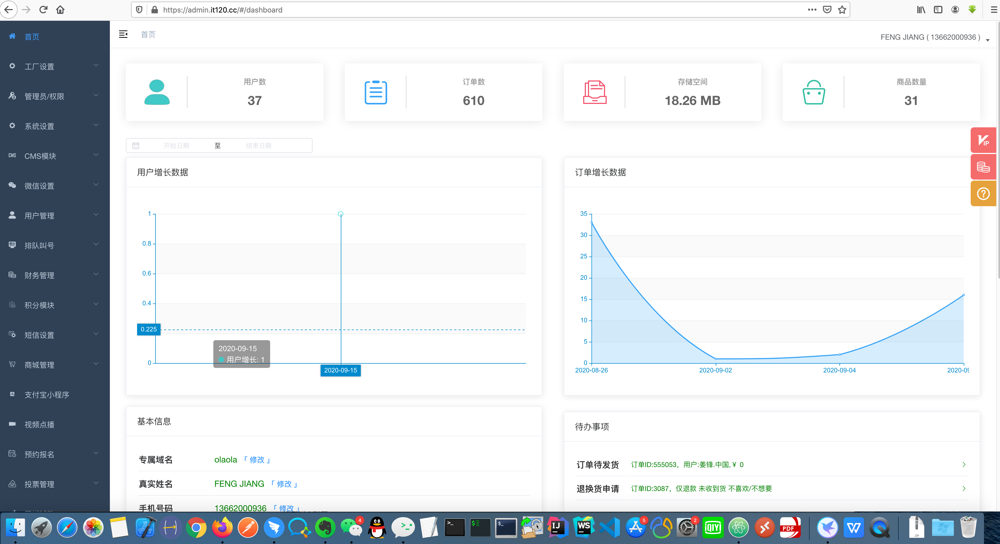
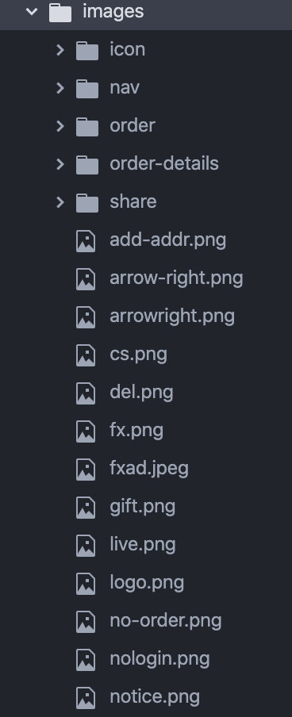
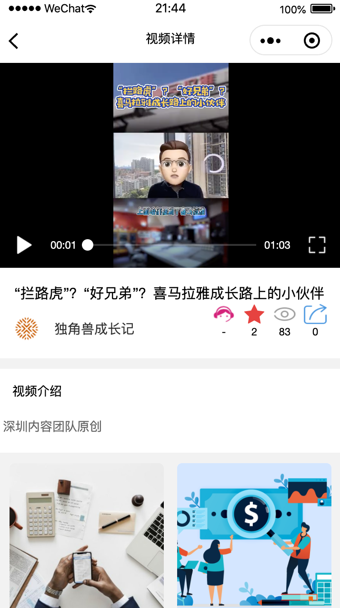

#OLAOLA微信小程序
主要是为金融行业提供的小程序服务，目前主要以视频为主。

#版本说明
目前为体验版本，版本号为1.0.0

#基本配置信息
微信后台管理URL：https://mp.weixin.qq.com/
用户名：chosentech@126.com
口令：chosentech2020
小程序ID：wxb64be3b10de24d10
小程序密钥：1b403d248c59f80eada03e130663965c

后台管理程序URL：https://admin.it120.cc/#/dashboard
后台管理程序用户：13662000936
后台管理程序口令：boya0322

#基本说明
##开发方式说明
采用云开发方式，云开发方式是指无需购买搭建自己的服务器，无需架设后台管理系统，无需编写api接口，仅仅使用云端开箱即用的开放接口，即可实现网站、手机app、各种小程序的开发。

和传统模式相比，在开发效率、开发成本和安全稳定性、性能等方面都有着显著优势。
##云开发供应商的选择

选择了“api工厂”云供应商，网站地址：https://www.it120.cc

- 后台登录地址：https://admin.it120.cc
  用户名： 13662000936
  口令： boya0322
  

- 后台管理界面：


##前端开发方式说明
- 前端采用微信小程序原生开发语言
- 微信小程序开发工具安装
  https://developers.weixin.qq.com/miniprogram/dev/devtools/download.html
- 微信小程序账号
  浏览器打开以下地址，微信扫码就可以快速获取微信小程序测试号
  https://developers/weixin.qq.com/sandbox

- OLAOLA小程序登录账户
  用户名：chosentech@126.com
  口令：口令：chosentech2020
  

  登录后进行扫码， 然后进入小程序管理界面：
  

- OLAOLA微信小程序APPID
  wxb64be3b10de24d10
  

- OLAOLA微信小程序服务器域名配置：
  request合法域名： https://api.it120.cc  https://cdn.it120.cc
  socket合法域名：  wss:/api.it120.cc
  uploadFile合法域名： https://api.it120.cc
  downloadFile合法域名：https://api.it120.cc

  

- OLAOLA小程序基本信息
  小程序名： OLAOLA
  小程序简称： OLAOLA
  介绍： 金融行业
  主体信息： 深圳前海至善科技信息工程有限公司
  服务类目：IT科技 -> 软件服务供应商

- OLAOLA普通二维码


- OLAOLA小程序码


#OLAOLA微信小程序前端开发

##安装小程序开发工具
  - 安装小程序开发工具
  https://developers.weixin.qq.com/miniprogram/dev/devtools/download.html
  - 安装atom开发工具
  为了更好进行开发，除了基本的小程序开发工具外，IDE工具还选择atom开发工具

##打开小程序开发工具

注意APPID要填写正确。

##OLAOLA源代码说明
 源代码打包为olaola2.zip，开发人员先解包，然后用atom开发工具打开源程序代码。

 - 源代码目录结构：
 

 备注：开发人员需要了解微信小程序开发语言

 - 配置文件config.js
 ```
 module.exports = {
   version: "1.0.0",
   note: 'olaola',
   subDomain: "olaola",
   goodsDetailSkuShowType: 0,
   shareProfile: "OLAOLA",
   shopMod: 0,
   videoCategoryId: 92165,
   articleCategoryId: 92166,
   eventCategoryId: 100404,
   fundCategoryId: 91131,
   estateCategoryId: 91132,
   insuranceCategoryId: 91133,
   secondMarketCategoryId: 91134,
   aiCategoryId: 91135

 }
 ```
**注意：在开发工具中config.js中的subDomain需要设置为你自己的专属域名，这里为olaola**

- 其他配置文件app.json

```
{
  "pages": [
    "pages/start/start",
    "pages/shop/select",
    "pages/index/index",
    "pages/video-list/index",
    "pages/video-details/index",
    "pages/article-index/index",
    "pages/article-list/index",
    "pages/article-detail/index",
    "pages/article-comment-list/index",
    "pages/event/index",
    "pages/my/index",
    "pages/favorite/index",
    "pages/history/index",
    "pages/notice/index",
    "pages/notice/show",
    "pages/category/category"
  ],
  "window": {
    "backgroundTextStyle": "light",
    "navigationBarBackgroundColor": "#fff",
    "navigationBarTitleText": "",
    "navigationBarTextStyle": "black",
    "onReachBottomDistance": 50
  },
  "tabBar": {
    "color": "#6e6d6b",
    "selectedColor": "#e64340",
    "borderStyle": "white",
    "backgroundColor": "#fff",
    "list": [
      {
        "pagePath": "pages/index/index",
        "iconPath": "images/nav/home-off.png",
        "selectedIconPath": "images/nav/home-on.png",
        "text": "视频"
      },
      {
        "pagePath": "pages/article-index/index",
        "iconPath": "images/nav/ic_catefory_normal.png",
        "selectedIconPath": "images/nav/ic_catefory_pressed.png",
        "text": "文章"
      },
      {
        "pagePath": "pages/event/index",
        "iconPath": "images/nav/cart-off.png",
        "selectedIconPath": "images/nav/cart-on.png",
        "text": "活动"
      },
      {
        "pagePath": "pages/my/index",
        "iconPath": "images/nav/my-off.png",
        "selectedIconPath": "images/nav/my-on.png",
        "text": "我的"
      }
    ]
  },
  "permission": {
    "scope.userLocation": {
      "desc": "获取离你最近的门店"
    }
  },
  "navigateToMiniProgramAppIdList": [
    "wx56c8f077de74b07c"
  ],
  "usingComponents": {
    "float-menu": "/components/float-menu/index",
    "parser":"/components/parser.20200414.min/parser",
    "van-notice-bar": "@vant/weapp/notice-bar/index",
    "van-search": "@vant/weapp/search/index",
    "van-divider": "@vant/weapp/divider/index",
    "van-icon": "@vant/weapp/icon/index",
    "van-count-down": "@vant/weapp/count-down/index",
    "van-button": "@vant/weapp/button/index"
  },
  "sitemapLocation": "sitemap.json"
}

```

- 重要的微信小程序工具包：apifm-wxapi
“apifm-wxapi”的github地址是：https://github.com/gooking/apifm-wxapi
采用“apifm-wxapi”模块可以实现快速开发。OLAOLA小程序中采用了该模块作为核心模块，大大减少了开发工作量，提高了效率。


- assets目录：主要存放readme用到的图片文件

- components： 主要是用到的重要组建，主要包括日历组件、浮动菜单组件和内容解析组件。

- images：主要存放程序用到的一些图片文件。


- template: 主要包括模版组件。


- utils：主要包括一些工具代码


- wxParse：主要包括解析文档内容的代码


- pages：是主要的代码部分，包含小程序的各个页面的代码。

下面针对一些重要的模块进行介绍：
  1. index：小程序首页模块，主要包括小程序视频内容，显示的栏目包括：推荐、基金、地产、保险、二级、A.I、人造肉、区块链和大数据。这些栏目对应分别对应后台一级分类视频下的二级分类目录中的内容。
  
  2. start：小程序启动模块，如果用户第一次使用，则显示一些欢迎页面。
  3. video-list：视频列表模块。
  
  4. video-details：视频详情模块。
  
  其中分别表示客服、收藏、观看和转发功能。
  5. my： 个人中心模块。主要包括用户的个人信息。
   主要包括：我的收藏、我的浏览、联系客服、用户登录及用户退出等功能
  
  6.  article： 文章内容模块，主要包括新闻、教育和视频等栏目、
  文章内容模块部分对应后台的CMS模块，内容取自后台CMS模块。而视频模块中的内容取自后台的商城管理中的商品管理模块。

  7. article-list： 文章列表模块。
  8. article-details：文章详细内容模块。
  9. event：活动模块，目前该部分尚未完成。

对于pages中每个模块来讲，主要包括4个文件，分别是js文件、json文件、wxml文件和wxss文件，这是开发原生微信小程序所需的基本文件。

## 下面简单介绍一些api的使用
##商城模块
###门店管理
####读取所有门店列表
```
 WXAPI.fetchShops(Object object)
```
#####接口返回示例：
```
{
  "code": 0,
  "data": [
    {
      "cityId": "150200000000",
      "dateAdd": "2019-07-18 17:45:26",
      "dateUpdate": "2019-07-29 09:37:19",
      "districtId": "150205000000",
      "id": 4963,
      "latitude": 39.916527,
      "linkPhone": "11",
      "longitude": 116.397128,
      "name": "111",
      "numberGoodReputation": 0,
      "numberOrder": 0,
      "paixu": 0,
      "provinceId": "150000000000",
      "status": 0,
      "statusStr": "正常",
      "userId": 2
    }
  ],
  "msg": "success"
}
```
###门店详情
```
 WXAPI.shopSubdetail(id)
```
id参数为门店列表返回数据中的id字段
###商品分类
####获取所有的分类
```
 WXAPI.goodsCategory()
```
读取后台设置的所有分类数据，分类之间的上下级关系使用level和pid管理
level=1 表示1级类目；2表示2级目录，以此类推
pid代表该类目的上级类目ID（一级类目的pid=0）
####获取分类详情
```
 WXAPI.goodsCategoryDetail(id)
```
###商品管理
####获取商品列表
```
 WXAPI.goods(Object object)
```
读取所有的商品数据，以分页的形式展示，支持按照多种方式进行排序，具体参数的说明，需要查阅接口文档
###获取商品详细信息
```
 WXAPI.goodsDetail(id)
```
id参数为上面商品列表方法返回数据里的id字段
访问该方法会增加商品的浏览量
该方法获取商品基础信息、商品图文详细介绍、商品图片、可选的规格尺寸、所属分类、商品扩展属性等等。
####获取商品的评价
```
  WXAPI.goodsReputation(Object object)
```
读取当前商品用户的所有评价数据

###商品收藏
####收藏某个商品
```
 WXAPI.goodsFavPut(token, goodsId)
```
####检测当前的商品是否已被收藏
```
 WXAPI.goodsFavCheck(token, goodsId)
```
####获取收藏的商品
```
 WXAPI.goodsFavList(Object object)
```
###会员管理
####获取会员等级
```
 WXAPI.userLevelList(Object object)
```
####查看会员等级详情
```
 WXAPI.userLevelDetail(levelId)
```
##CMS模块分类管理
###获取所有分类
```
 WXAPI.cmsCategories()
```
###获取分类详情
```
 WXAPI.cmsCategoryDetail(id)
```
##CMS模块文章管理
###文章列表
```
 WXAPI.cmsArticles(Object object)
```
###文章详情
```
 WXAPI.cmsArticleDetail(id)
```

#OLAOLA微信小程序后端内容发布

## 启用需要的模块
登录注册的后台，左侧菜单--> 工厂设置 --> 模块管理

启用的主要模块包括
  1.CMS模块
  2.用户管理
  3.积分模块
  4.商城管理
  5.视频点播
  等

  其中视频点播和商城管理是最为重要的2个模块

## 视频点播模块

进入视频点播模块，通过上传视频，将视频文件上传到服务器，上传后，服务器会对视频文件进行处理，生成多种格式的视频文件提供播放，我们重要使用MP4格式进行播放视频。注意，转换后的视频在清晰度方面会有所损失。
内容发布人员主要关注“视频ID”参数。

##视频内容发布
视频内容主要有视频点播模块和商城模块中进行管理
- 视频分类（商品分类）


商品分类目录：主要包括一级目录和二级目录
一级目录： 视频
二级目录：
  1.基金
  2.地产
  3.保险
  4.二级
  5.A.I
  6.人造肉
  7.区块链
  8.大数据

- 商城管理中的门店管理
点击【门店管理】

利用门店管理功能，可以设置不同的公司。


- 商城管理中的商品管理
在商品管理中进行视频内容的发布

点击【发布单个商品】，显示如下：


重点的内容字段：
1.所属店铺： 输入公司的名称
2.商品分类： 会列出所有的商品分类，从中进行选择。例如：视频-->基金
3.商品名称： 一般作为视频的标题
4.商品类型： 选择【虚拟商品】
5.标签（关键字）：相当于视频的tag标签
6.是否推荐： 如果选为推荐，则该视频会出现在小视频的首页
7.商品状态： 选择【上架】，否则的话，该视频不会显示在小程序中。
8.视频编号： 该内容很重要，要输入在【视频点播】中上传视频后产生的视频ID参数
9.商品图片： 该内容很重要，主要用于显示视频的封面
10. 详细介绍： 显示视频的内容介绍

我们在管理视频时主要用到了以上字段的内容，其他字段可以忽略。

##文章内容发布
文章内容在CMS模块中进行管理
###分类管理

一级目录：内容库
二级目录：
 1. 新闻
 2. 教育
 3. 视频

 ### 文章管理
 
 文章内容：
 
 主要包括：
  1. 标题
  2. 文章分类
  3. 关键词
  4. 标签
  5. 摘要
  6. 长传图标
  7. 是否推荐
  8. 状态
  9. 排序
  10. 内容
  
